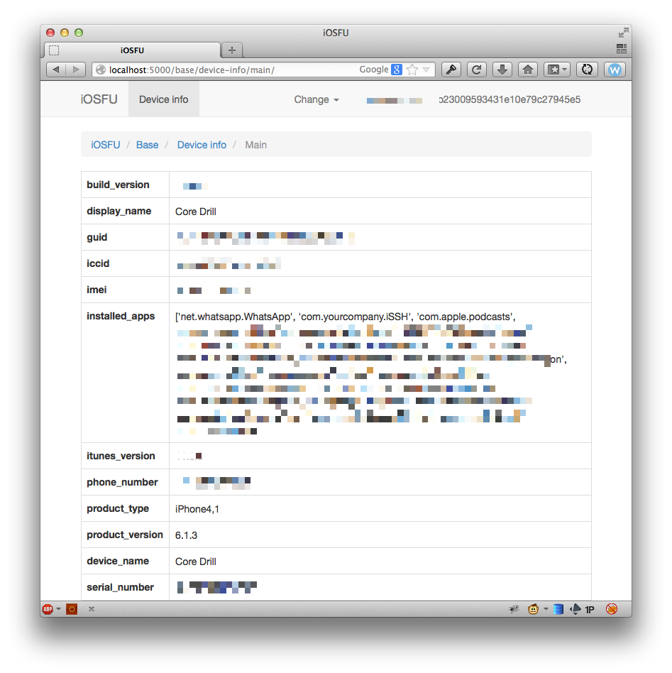

iosfu
=====

iOS forensics utility

## Local environment setup

1. Create a local python2 environment and install requirements:

```
virtualenv -p python2 .venv
source .venv/bin/activate
pip install -r requirements.txt
```

2. Create a `_backups` folder on the project path and place there your iOS backups
    > You can override this by editing the `BACKUPS_PATH` variable in `iosfu/conf.py`.

3. Run the interface using `iosfu_gui`:

```
./iosfu_gui
```

Server should be listening in http://127.0.0.1:5000/ and you should see a backup selector in the top right corner.

## How it works

This application is mainly composed by plugins that render GUI elements.

The plugin contains the logic of what it should do, and in a `gui` module the UI is defined via Panels and Sections.
- Sections are the navigation elements rendered on the header of the site.
- Panels are the content for the plugin.

The plugins should be self served, with all the logic related to the work they do inside its package.

For a basic example, take a look [at the device info plugin](iosfu/plugin/device_info)

- `gui.py` contains the GUI information
- `plugin.py` contains the plugin logic, masked in a *pseudo magic method* called `__do__`.

## GUI example

[](images/poc1.png)

## Disclaimer

> ⚠️ Keep in mind that this is an old project I did for research purposes and its not maintained.

The usual disclaimer:

```
NO WARRANTY

THE PROGRAM IS DISTRIBUTED IN THE HOPE THAT IT WILL BE USEFUL, BUT WITHOUT ANY WARRANTY.
IT IS PROVIDED "AS IS" WITHOUT WARRANTY OF ANY KIND, EITHER EXPRESSED OR IMPLIED,
INCLUDING, BUT NOT LIMITED TO, THE IMPLIED WARRANTIES OF MERCHANTABILITY AND FITNESS
FOR A PARTICULAR PURPOSE. THE ENTIRE RISK AS TO THE QUALITY AND PERFORMANCE OF THE
PROGRAM IS WITH YOU. SHOULD THE PROGRAM PROVE DEFECTIVE, YOU ASSUME THE COST OF ALL
NECESSARY SERVICING, REPAIR OR CORRECTION.

IN NO EVENT UNLESS REQUIRED BY APPLICABLE LAW THE AUTHOR WILL BE LIABLE TO YOU FOR DAMAGES,
INCLUDING ANY GENERAL, SPECIAL, INCIDENTAL OR CONSEQUENTIAL DAMAGES ARISING OUT OF THE
USE OR INABILITY TO USE THE PROGRAM (INCLUDING BUT NOT LIMITED TO LOSS OF DATA OR
DATA BEING RENDERED INACCURATE OR LOSSES SUSTAINED BY YOU OR THIRD PARTIES OR A FAILURE
OF THE PROGRAM TO OPERATE WITH ANY OTHER PROGRAMS), EVEN IF THE AUTHOR HAS BEEN ADVISED
OF THE POSSIBILITY OF SUCH DAMAGES.
```
